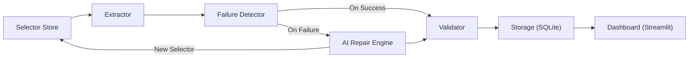

# 🔧 Self-Healing Financial Data Scraper

**An AI-powered scraper that automatically detects and repairs broken CSS selectors to ensure continuous financial data extraction.**

---

## 🚨 Problem Statement

Financial data (stock prices, company metrics, market cap, P/E ratios) is scattered across websites whose HTML structure changes frequently. Traditional scrapers rely on fixed CSS selectors and break silently when a site redesigns, producing missing, stale, or wrong data that harms financial decision-making.

## 💡 Solution Overview

This system solves the brittleness of traditional scrapers with **self-healing capabilities**. When a scrape cycle fails (selectors return empty data or structurally invalid results), the pipeline automatically activates an AI Repair Engine. This engine intelligently scans the DOM using a dual-layer approach (fast heuristics + optional LLM refinement), finds the new location of target data, generates new CSS selectors, validates the recovered data, and updates its internal selector database — all without human intervention.

**Key Features:**
- ✅ **Automated Failure Detection** — validates extracted data against expected formats and historical patterns
- 🔧 **Dual-Layer AI Repair Engine** — fast heuristic scoring (always works, no API key needed) + optional LLM reasoning layer
- 🛡️ **Robust Validation** — format, type, range, and drift checks before data is marked trustworthy
- 📊 **Interactive Dashboard** — Streamlit UI with live extraction status, repair history, alerts, and demo controls
- 🎯 **Demoable** — local mock site with instant v1↔v2 switching simulates a real site redesign

## 🏗️ Architecture



| Component | Role |
|-----------|------|
| **Selector Store** | Manages versioned CSS selectors per site + field. Config-driven, keyed by `site_id`. |
| **Extractor** | Fetches HTML (with retries, rate limiting, rotating user-agent) and extracts data using stored selectors. |
| **Failure Detector** | Flags fields where: selector matches zero elements, value is empty, or value doesn't match expected format. |
| **AI Repair Engine** | **Core AI component.** Two-layer: heuristic candidate scoring (regex, label proximity, attribute matching, value similarity) + optional LLM refinement via Anthropic Claude. |
| **Validator** | Checks format (regex), type parsing, range/sanity bounds, and drift against historical values. Produces pass/fail/flagged status. |
| **Storage** | SQLite with tables for extracted data, selector history, repair log, alerts, and scrape status. |
| **Dashboard** | Streamlit UI with demo controls, live data view, repair history, alerts, and per-field cycle details. |

---

## 🔍 How It Works — For Judges

### 1. How Failure Detection Works

The Failure Detector runs three automated checks on every extracted field:

| Check | Condition | Severity |
|-------|-----------|----------|
| **Selector Miss** | CSS selector returned zero elements | 🔴 Critical |
| **Empty Value** | Selector matched an element but text content is empty/whitespace | 🔴 Critical |
| **Format Mismatch** | Extracted text doesn't match the field's expected regex pattern (e.g., `$342.57` should match `[\$]?\s*[\d,]+\.?\d*`) | 🟡 Warning |

Any critical failure triggers the AI Repair Engine. No manual intervention needed.

### 2. How AI Repair Works

This is the core of the system's intelligence. Two layers:

**Layer 1 — Heuristic Candidate Scoring (always runs, no API key needed):**

The engine scans every text-containing element in the DOM and scores each candidate across 4 dimensions:

| Dimension | Weight | What It Measures |
|-----------|--------|-----------------|
| **Regex Match** | 35% | Does the element's text match the field's expected data pattern? Full match = 1.0, partial = 0.5 |
| **Label Proximity** | 25% | Are label texts matching known synonyms (e.g., "Price" / "LTP" / "CMP") found near this element? Uses fuzzy matching (rapidfuzz, threshold 80). |
| **Attribute Match** | 25% | Do the element's `id`, `class`, `data-*` attributes contain keywords related to the field? Checks element and up to 3 ancestor levels. |
| **Value Similarity** | 15% | How close is the candidate text to the last known good value? Numeric comparison for numbers, fuzzy string ratio for text. |

Combined into: `confidence = Σ(weight × score) × leaf_factor`

The `leaf_factor` penalizes container elements (whose text comes from children) vs. direct-text leaf elements, ensuring precision.

**Layer 2 — LLM Reasoning (optional, activates if `ANTHROPIC_API_KEY` is set):**

If an API key is present, the top 3 heuristic candidates with their HTML context and field metadata are sent to Claude (`claude-sonnet-4-6`) via the Anthropic SDK. The LLM picks the best candidate and provides a JSON response with `chosen_index`, `confidence`, and `justification`. This can override or refine the heuristic selection.

**Graceful fallback:** If no API key is set, or the LLM call fails, the system uses the heuristic result. The system **always works end-to-end without an API key**.

### 3. How Validation Works

Before any recovered (or normal) value is marked reliable, four checks run:

| Check | Logic | Output |
|-------|-------|--------|
| **Format** | Does value match field's regex pattern? | pass / fail |
| **Type** | Can value be parsed as expected type (numeric, currency, text)? | pass / fail |
| **Range** | Is numeric value within configured min/max bounds? (e.g., P/E: 0–500) | pass / fail / skip |
| **Drift** | Does value deviate from last known good value beyond threshold? (e.g., >50% change) | pass / flagged / skip |

Final status: **fail** if format or type fails, **flagged** if drift triggers, **pass** otherwise.
Confidence score = average of active check scores (1.0=pass, 0.5=flagged, 0.0=fail).

---

## 🛠️ Tech Stack

| Technology | Purpose |
|-----------|---------|
| **Python 3.8+** | Core pipeline logic |
| **BeautifulSoup4** | HTML parsing and DOM traversal |
| **requests** | HTTP fetching with retries and rate limiting |
| **SQLite** | Lightweight embedded storage for all data, history, and logs |
| **Streamlit** | Interactive dashboard for monitoring and demo |
| **anthropic SDK** | Optional LLM integration for advanced semantic repair |
| **rapidfuzz** | Fast fuzzy string matching for heuristic scoring |

## ⚙️ Setup & Installation

```bash
# Clone or navigate to the project directory
cd self-healing-scraper

# Install dependencies
pip install -r requirements.txt
```

*(Optional)* To enable the LLM repair layer:
```bash
# Linux/Mac
export ANTHROPIC_API_KEY="your-api-key-here"

# Windows PowerShell
$env:ANTHROPIC_API_KEY="your-api-key-here"
```

## 🚀 How to Run

```bash
# Launch the Streamlit dashboard
streamlit run dashboard.py
```

The dashboard auto-starts the mock server and initializes the pipeline.

## 🧪 Run the End-to-End Test

```bash
python test_e2e.py
```

This runs the complete v1→v2→repair→validate loop and verifies all 6 fields are correctly repaired.

## 🎬 How to Demo This (click-by-click)

1. **Start the dashboard:** `streamlit run dashboard.py`
2. **Observe:** Sidebar shows Mock Site Version = **"v1"** (original layout)
3. **Click "🚀 Run Scrape Cycle"** → All 6 fields extracted successfully with green pass status in the **📊 Live Data** tab
4. **Click "🔄 Switch to v2 (Redesign)"** → Sidebar confirms v2 is active (simulates a real site redesign)
5. **Click "🚀 Run Scrape Cycle"** again → The system:
   - **Detects** all 6 selectors are broken (Failure Detector flags "Selector matched no elements")
   - **Repairs** each field automatically (AI Repair Engine finds new selectors via heuristic scoring)
   - **Validates** all recovered values (format, type, range, drift checks all pass)
6. **Check 📊 Live Data tab** → All values recovered correctly ($342.57, +2.43%, $1.28T, etc.)
7. **Check 🔧 Repair History tab** → See old selector → new selector mappings with confidence scores and justifications
8. **Check 🚨 Alerts tab** → See failure detection alerts and repair success notifications
9. **Check 📋 Cycle Details tab** → Expandable per-field details with extraction, failure, repair, and validation info
10. *(Optional)* Set `ANTHROPIC_API_KEY` and re-run to see LLM-enhanced justifications

## 🌍 Production Extension Path

The system is designed for easy extension to real financial sites:

1. **Add a new site config** in `src/config.py` — define a `site_id`, target URL, and initial CSS selectors
2. **Map field definitions** — specify field type, regex pattern, validation bounds, and label synonyms
3. **Run the pipeline** — the Selector Store, Extractor, Repair Engine, and Validator are completely site-agnostic; they work off the config-driven field metadata

The selector store is keyed by `site_id + field_name`, so multiple sites can be scraped in parallel with independent selector histories.

## 📂 Project Structure

```
self-healing-scraper/
├── dashboard.py           # Streamlit dashboard UI
├── test_e2e.py            # End-to-end integration test
├── requirements.txt       # Python dependencies
├── README.md              # This file
├── mock_site/
│   ├── v1.html            # Mock financial page — original layout
│   └── v2.html            # Mock financial page — redesigned layout
├── src/
│   ├── __init__.py
│   ├── config.py          # Field definitions, selectors, constants
│   ├── storage.py         # SQLite database layer
│   ├── selector_store.py  # Versioned selector management
│   ├── extractor.py       # HTML fetching and data extraction
│   ├── failure_detector.py # Automated failure detection
│   ├── ai_repair.py       # Heuristic + LLM repair engine
│   ├── validator.py       # Data validation (format, type, range, drift)
│   ├── mock_server.py     # Local HTTP server for mock site
│   └── pipeline.py        # Orchestrates the full scrape cycle
└── data/
    └── scraper.db         # SQLite database (auto-created)
```

## 🧠 Methodology

Our approach emphasizes a **heuristic-first design**. While LLMs are powerful, running them on every scrape failure is slow, expensive, and prone to token limits on massive DOMs. By relying on robust, rules-based heuristics (regex, proximity, attribute scoring, value similarity) as the primary repair mechanism, we ensure **high-speed, low-cost recovery** that works offline.

The LLM acts as an optional, high-intelligence refinement layer for cases where heuristics produce ambiguous results. The confidence scoring system bridges both methods, providing **transparency and explainability** — judges (and operators) can see exactly *why* a selector was chosen and *how confident* the system is in each repair.

Key design decisions:
- **Leaf-node preference**: Container elements are penalized vs. direct-text elements, avoiding false matches on parent nodes
- **Data-attribute awareness**: The selector generator leverages `data-*` attributes for uniqueness (critical for modern web frameworks)
- **Uniqueness verification**: Generated selectors are tested against the DOM to ensure they uniquely identify exactly one element
- **Graceful degradation**: The system always works without an API key, without network access (using local mock HTML), and without any manual intervention
